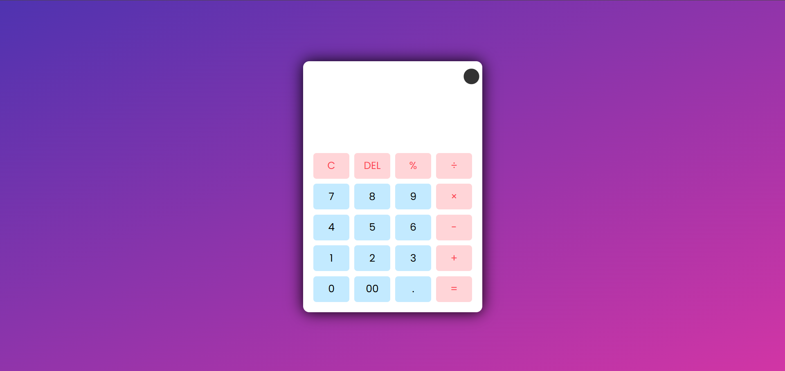

# 🖩 Responsive Calculator with Light & Dark Theme  


A modern, responsive, and user-friendly calculator built using **HTML, CSS, and JavaScript**.
It supports **light & dark themes**, smooth UI interactions, and works perfectly across **all devices**.

---

## 📸 Screenshots  

| ☀️ Light Mode | 🌙 Dark Mode |
|------------|------------|
|  |  |

---

## 🌐 Live Demo

The project is live and can be played here: [View Live Calculator](https://tonystark-19.github.io/Calculator/)

--- 

## ✨ Features  

- **📱 Fully Responsive** – Optimized for phones, tablets, and desktops.
- **🌗 Light & Dark Themes** – Toggle easily between both modes.
- **➕ Basic Arithmetic Operations** – Addition, subtraction, multiplication, division.
- **💯 Percentage Support** – Quickly calculate percentage-based results.
- **🧼 Clear & Delete Options** – Reset everything or remove the last input.
- **🎨 Smooth, Clean UI** – Crisp design with subtle animations.

---

## 🛠️ Technologies Used  

| Technology           | Purpose                                 |
| -------------------- | --------------------------------------- |
| **HTML5**            | Structure of the calculator             |
| **CSS3**             | Styling, animations, and responsiveness |
| **JavaScript (ES6)** | Functional logic and interactivity      |

---

## 📝 How to Use  

1️⃣ Click the buttons or use the keyboard to input numbers & operations.  
2️⃣ Press **"="** to compute results.  
3️⃣ Use **"C"** to clear the display and **"DEL"** to remove the last entry.  
4️⃣ Click the **theme toggle button** in the top-right corner to switch between light & dark modes.  

---

## 🛠️ How to run on your own system

1. Clone the repository:

   ```bash
   git clone https://github.com/TonyStark-19/Calculator.git
   ```

2. Navigate into the project folder:

   ```bash
   cd Calculator
   ```

3. Open `index.html` in your browser.

---

Enjoy using the **Responsive Calculator**! 🖩✨  
