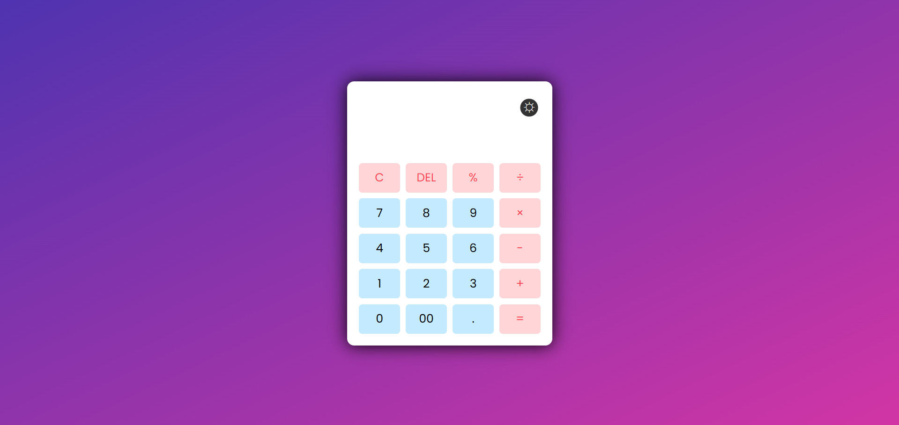
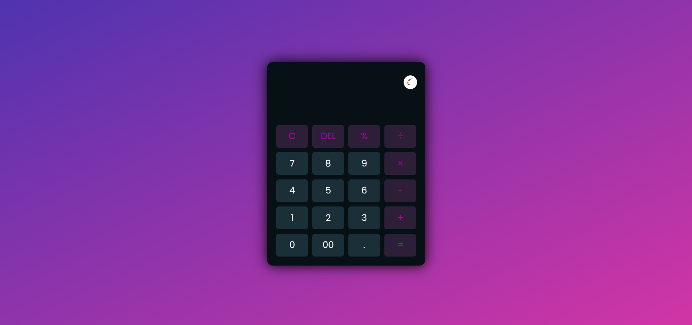

# 🖩 Responsive Calculator with Light & Dark Theme  

A **sleek and functional calculator** built using **HTML, CSS, and JavaScript**. This calculator is **fully responsive**, supports **light and dark modes**, and is deployed on **GitHub Pages**.  

---

## ✨ Features  

✅ **Responsive Design** – Works seamlessly across all devices.  
🌗 **Light & Dark Theme** – Easily toggle between themes.  
➕➖ **Basic Operations** – Supports addition, subtraction, multiplication, division, and percentages.  
🎨 **Interactive UI** – Smooth animations & user-friendly interface.  

---

## 🚀 Live Demo  

🔗 **[View Live Calculator](https://tonystark-19.github.io/Calculator/)**  

---

## 📸 Screenshots  

### ☀️ Light Mode:  
  

### 🌙 Dark Mode:  
  

---

## 🛠️ Technologies Used  

- **🖥️ HTML5** – Page structure.  
- **🎨 CSS3** – Styling & responsiveness.  
- **⚡ JavaScript** – Core functionality & dynamic features.  

---

## 📝 How to Use  

1️⃣ Click the buttons or use the keyboard to input numbers & operations.  
2️⃣ Press **"="** to compute results.  
3️⃣ Use **"C"** to clear the display and **"DEL"** to remove the last entry.  
4️⃣ Click the **theme toggle button** in the top-right corner to switch between light & dark modes.  

---

Enjoy using the **Responsive Calculator**! 🖩✨  
